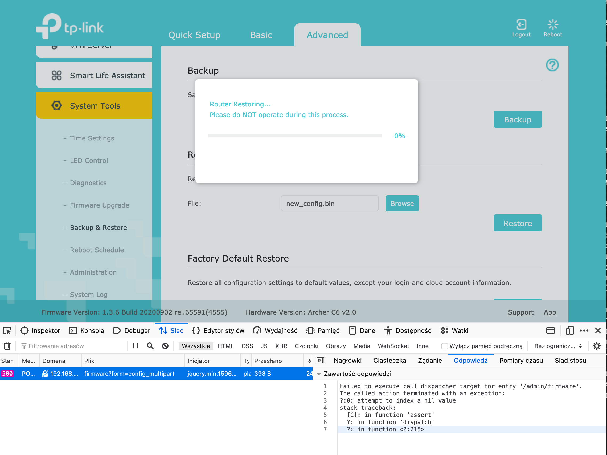

This story begins with simple need - ability to programmatically obtain all devices connected to my Wi-Fi router - TP-Link Archer C6. None of the existing libraries support this version of Web UI. The issue with the simplest solution (just flashing OpenWRT) - I rely on proprietary OneMesh technology, which enables better home mesh-networking. So, some hacking needed to be done.

<!--more-->

## First SSH attempt

If you try to SSH to Archer C6 using standard port 22 you'll be surprised to see port open and even accepting admin's password (the same as for Web UI). But the only thing you can do is set up of port forwarding. All other channels are disabled.

Example response from ssh:

```
PTY allocation request failed on channel 0
shell request failed on channel 0
```


Turns out this is for mobile apps, like Tether to control router. Not very helpful since we don't know network topology and services behind it. More on that at official TP-Link website: https://www.tp-link.com/us/support/faq/2462/ 

## New target - modify config backup and restore it

Apparently, a configuration backup file you can download (and then restore) from Web UI contains flags for dropbear (small SSH server) that can enable typical usage of SSH.

Obviously, the fun begins when the backup is encrypted - `file` command says it's type is `data`. Some places on the Internet suggest that reverse engineering binaries in a firmware file (freely available on TP-Link's website) may reveal a hard-coded encryption key.

Great resources on that include: https://forum.openwrt.org/t/build-for-tp-link-archer-c1200-ac1200/2547/40 and https://github.com/knownunown/tpl-c900-openwrt-install

## Getting hands on firmware

First, we need to download firmware - it's on https://www.tp-link.com/pl/support/download/archer-c6/#Firmware, the latest one for C6 v2 which I own is `Archer C6(EU)_V2_200902`. For some reason build number is not in the same format in Web UI as on the download page, but you can easily work it out. One crucial note - you must select the proper region, as US version differs from EU one.

In ZIP archive we have manuals and `bin` file with firmware, which we can easily extract using `binwalk`:

```bash
daniel@yggdrasil Archer C6(EU)_V2_200902 % binwalk -e ArcherC6v2_eu-up-ver1-3-6-P1\[20200902-rel65591\].bin 

DECIMAL       HEXADECIMAL     DESCRIPTION
--------------------------------------------------------------------------------
8489          0x2129          uImage header, header size: 64 bytes, header CRC: 0x91FC4042, created: 2020-07-01 10:19:12, image size: 1047980 bytes, Data Address: 0x80060000, Entry Point: 0x80060000, data CRC: 0x635DC658, OS: Linux, CPU: MIPS, image type: Multi-File Image, compression type: lzma, image name: "MIPS OpenWrt Linux-3.3.8"
8561          0x2171          LZMA compressed data, properties: 0x6D, dictionary size: 8388608 bytes, uncompressed size: 3043948 bytes
1056534       0x101F16        Squashfs filesystem, little endian, version 4.0, compression:xz, size: 6874966 bytes, 1595 inodes, blocksize: 1048576 bytes, created: 2020-07-31 08:49:37
7931694       0x79072E        XML document, version: "1.0"
7943484       0x79353C        gzip compressed data, from Unix, last modified: 2020-09-02 10:13:11

daniel@yggdrasil Archer C6(EU)_V2_200902 % 
```


The squashfs file is automatically extracted and there we have an unencrypted filesystem of what's going to land on router's flash memory. 1:1.

Other researchers had success with locating `crypto.lua` (which is a central cryptographic library for UI and management tools of the router) and extracting encryption key and IV for AES256 in ECB mode - simply by listing strings. I didn't have such luck.

```bash
daniel@yggdrasil _ArcherC6v2_eu-up-ver1-3-6-P1[20200902-rel65591].bin.extracted % sha256sum squashfs-root/usr/lib/lua/luci/model/crypto.lua 
669fe09728b472feb3175edf9f6fd0cc9c61f91521c1b2480a55f3cae2fa5cbf  squashfs-root/usr/lib/lua/luci/model/crypto.lua
daniel@yggdrasil _ArcherC6v2_eu-up-ver1-3-6-P1[20200902-rel65591].bin.extracted % strings squashfs-root/usr/lib/lua/luci/model/crypto.lua 
LuaQ
require
luci.sys
nixio
luci.util
module
luci.model.crypto
package
seeall
aes-256-cbc
openssl zlib -e %s | openssl 
 -e %s
openssl 
 -d %s %s | openssl zlib -d
 -e %s %s
 -d %s %s
-in %q
-k %q
-kfile /etc/secretkey
enc_file
dec_file
dump_to_file
enc_file_entry
dec_file_entry
type
string
/etc/secretkey
require
luarsa
aes_enc_file
type
string
/etc/secretkey
require
luarsa
aes_dec_file
type
string
require
luarsa
aes_enc
type
string
require
luarsa
aes_dec
open
write
close
enc_file
dec_file
daniel@yggdrasil _ArcherC6v2_eu-up-ver1-3-6-P1[20200902-rel65591].bin.extracted % 
```


Two things stand out. First - mentioned mode of AES256 differs (here it's CBC; nice comparison is [here](https://datalocker.com/what-is-the-difference-between-ecb-mode-versus-cbc-mode-aes-encryption/)).

Secondly we see mention of `-kfile /etc/secretkey` which suggests that instead of a hard-coded key in the library we have some key file located on flash memory. That key file is nowhere to be found in firmware files, it's also not referenced by plaintext name in any other place that could create it dynamically, for example from MAC address. As I verified after successfully obtaining the shell - it's not present on the device itself, so this must be some unused functionality. The only thing that turned out on Google is [that cryptic presentation](https://hitcon.org/2020/slides/LEAYA%20Last%20Exploitation%20%E7%B5%A2%20An%20Embedded%20System%20Detection%20and%20Response.pdf) 

## Other files and discovery of `mybackup`

After some time spent on investigating `/etc/secretkey` I proceeded to study other files on squashfs.

My gold mine appeared to be a directory `/usr/bin/tr069/` and especially two Lua scripts related to backup/restore - which are not compiled to bytecode!

```bash
check_device_sn: Lua script text executable, ASCII text
check_params:    Lua script text executable, ASCII text
diagnostic:      Lua script text executable, ASCII text
generate_hosts:  Lua script text executable, ASCII text
get_wifimac:     ASCII text
mybackup:        Lua script text executable, UTF-8 Unicode text
myddns:          Lua script text executable, ASCII text
mynat:           POSIX shell script text executable, ASCII text
mypasswd:        Lua script text executable, ASCII text
myportforward:   Lua script text executable, ASCII text
myppp:           Lua script text executable, ASCII text
myremote:        Lua script text executable, ASCII text
myrestore:       Lua script text executable, UTF-8 Unicode text
myupgrade:       Lua script text executable, ASCII text
```


Here's the most interesting part of `mybackup`:

```lua
#!/usr/bin/lua

local firm = require "luci.controller.admin.firmware"
local util = require "luci.util"
local cry = require "luci.model.crypto"
local configtool = require "luci.sys.config"
local fs = require "luci.fs"
local uci = require "luci.model.uci"
local uci_r = uci.cursor()

function backup()
    local model = uci_r:get("locale", "sysinfo", "model") or ""
    if model == "Archer C6 v2" then
        -- 备份extern分区, 如有特殊情况的分区，再特殊处理
        local extern_partitions = uci_r:get_profile("backup_restore", "extern_partition") or nil
        if extern_partitions ~= nil then
            extern_partitions = util.split(extern_partitions, " ")
            os.execute("mkdir /tmp/backupfolder >/dev/null 2>&1")

            for i, v in ipairs(extern_partitions) do
                if v ~= nil then
                    luci.sys.exec("nvrammanager -r /tmp/backupfolder/ori-backup-" .. v .. ".bin -p " .. v .. " >/dev/null 2>&1")
                end
            end

            --打包
            luci.sys.exec("nvrammanager -r /tmp/backupfolder/ori-backup-user-config.bin -p user-config >/dev/null 2>&1")
            configtool.decryfile("/tmp/backupfolder/ori-backup-user-config.bin", "/tmp/backupfolder/ori-backup-user-config.bin")
            --delCloudCfgfrom("/tmp/backupfolder/ori-backup-user-config.bin")
            os.execute("tar -cf /tmp/backup -C /tmp/backupfolder . >/dev/null 2>&1")
            luci.sys.exec("rm -rf /tmp/backupfolder >/dev/null 2>&1")
        else
            luci.sys.exec("nvrammanager -r /tmp/backup -p user-config >/dev/null 2>&1")
            configtool.decryfile("/tmp/backup", "/tmp/backup")
            --delCloudCfgfrom("/tmp/backup")
        end     
        --luci.sys.exec("cat /dev/".. get_mtd("userconf") .. " > /tmp/backup")
        --luci.sys.exec("nvrammanager -r /tmp/backup -p  user-config   >/dev/null 2>&1")

        local cry = require "luci.model.crypto"
        cry.enc_file("/tmp/backup", "/tmp/backup.cry", "0123456789abcdef    ")
        luci.sys.exec("rm /tmp/backup")
        luci.sys.exec("cp /tmp/backup.cry /tmp/save-backup-userconf.bin; rm /tmp/backup.cry")
    else
```


We can quite safely assume `enc_file` from package `luci.model.crypto` takes parameters in the following order: file to encrypt, target file, encryption key. So, the encryption key is `0123456789abcdef____`, where `_` are space characters. I guess that those spaces on the end are there to make grepping over binaries harder.

## First attempt to decrypt config file

Having encryption key I tried to adapt the command I found on OpenWRT forum, but it didn't work. Apparently, there are some unknown variations to that AES encryption, or it's neither CBC nor ECB.

```bash
daniel@yggdrasil Downloads % openssl enc -aes-256-cbc -d -in config.bin -out config.tar -k '0123456789abcdef    '
bad magic number
daniel@yggdrasil Downloads % 
```


## Reverse engineering `crypto.lua`

It was time to investigate that `crypto.lua` library I mentioned on the beginning.

I certainly lack skills to replicate reverse engineering described on <https://pentestmag.com/unscrambling-lua/>

I could only confirm that in my case it's also `Lua5.1` bytecode for `mips:isa32r2` (32-bit) architecture. As author of linked research I also tried `luadec` and additionally `unluac` (<https://sourceforge.net/projects/unluac/>) but both complained on wrong symbols, presumably due to incorrect architecture. My lack of insight into Lua also didn't help. I also tried onlinedisassembler.com, but this one showed the entire file as `.data` section - it was unable to find an entry point for execution. 

Stopping point for me was working on instruction level, especially since I don't know MIPS architecture well.

## Another approach

After some break from research had a simple idea - since bytecode in Lua binaries on router firmware is scrambled using some extensions to Lua compiler/runtime it's enough just to execute that `crypto.lua` library using embedded Lua runtime and code excerpts from `mybackup` and `myrestore`. There was no obvious reason why that would be blocked in any additional way - there were no weird includes in that library that could show for example serial number dependent bavahiour. So, I just needed a MIPS emulator.

## QEMU to the rescue

That section will describe how to quickly set up MIPS VM with Debian. It's heavily based on <https://www.novetta.com/2018/02/emulating-embedded-linux-systems-with-qemu/>

Preferably in `screen` we need to run:

```bash
apt install qemu-system-mips screen
mkdir linux_mips; cd linux_mips
wget https://people.debian.org/~aurel32/qemu/mips/vmlinux-3.2.0-4-4kc-malta
wget https://people.debian.org/~aurel32/qemu/mips/debian_wheezy_mips_standard.qcow2
qemu-system-mips -M malta -kernel vmlinux-3.2.0-4-4kc-malta -hda debian_wheezy_mips_standard.qcow2 -append "root=/dev/sda1" -nographic -nic user,hostfwd=tcp::2222-:22
```


The above setup boots VM with root password `root` and forwards `localhost:2222` to `sshd` on VM. 

Now we need to transfer squashfs there. To avoid installing squashfs tools on VM however we can unpack it using `unsquashfs` and repack it with `tar czf squashfs-root.tar.gz`. Then we need to transfer the file over SCP. Additionally, an encrypted backup file should be on VM as well.

And now let's chroot to C6's firmware

```bash
root@sandbox2:~# ssh -p 2222 127.0.0.1
root@127.0.0.1's password: 
Linux debian-mips 3.2.0-4-4kc-malta #1 Debian 3.2.51-1 mips

The programs included with the Debian GNU/Linux system are free software;
the exact distribution terms for each program are described in the
individual files in /usr/share/doc/*/copyright.

Debian GNU/Linux comes with ABSOLUTELY NO WARRANTY, to the extent
permitted by applicable law.
Last login: Sat Feb 20 21:59:23 2021 from 10.0.2.2
root@debian-mips:~# 
root@debian-mips:~# tar zxf squashfs-root.tar.gz
root@debian-mips:~# cd squashfs-root/
root@debian-mips:~/squashfs-root# chroot . ./bin/sh


BusyBox v1.19.4 (2020-08-24 18:31:00 CST) built-in shell (ash)
Enter 'help' for a list of built-in commands.

/ # 
```


## Decryption and extraction

Assuming that our working directory with backup file is `/root` in chroot (`~/squashfs-root/root/` on host Linux) we can try the simplest approach - running interactive interpreter of provided Lua with `crypto.lua` loaded:

```bash
/ # lua -i /usr/lib/lua/luci/model/crypto.lua 
Lua 5.1.4  Copyright (C) 1994-2008 Lua.org, PUC-Rio (double int32)
> cry = require "luci.model.crypto"
> cry.dec_file("/root/ArcherC6v220200902136n.bin", "/root/backup.decrypted", "0123456789abcdef    ")
CONFIG_TP_AES_MAGIC_NUM:acac!
htonl tp_magic_num:acac!
htonl org_file_len:3e00!
> 
```


Seems to do something! Let's see what was written into `/root/backup.decrypted`:

```bash
root@debian-mips:~/squashfs-root/root# ls
ArcherC6v220200902136n.bin  backup.decrypted
root@debian-mips:~/squashfs-root/root# file backup.decrypted 
backup.decrypted: POSIX tar archive (GNU)
root@debian-mips:~/squashfs-root/root# 
```


It worked! Let's dive further:

```bash
root@debian-mips:~/squashfs-root/root# tar xvf backup.decrypted
./
./ori-backup-user-config.bin
./ori-backup-certificate.bin
root@debian-mips:~/squashfs-root/root# file ori-backup-user-config.bin
ori-backup-user-config.bin: gzip compgressed data, from Unix, last modified: Sat Feb 20 02:00:03 2021, max compression
root@debian-mips:~/squashfs-root/root# mv ori-backup-user-confi.bin ori-backup-user-config.gz
root@debian-mips:~/squashfs-root/root# gzip -d ori-backup-user-config.gz 
root@debian-mips:~/squashfs-root/root# file ori-backup-user-config
ori-backup-user-config: POSIX tar archive (GNU)
root@debian-mips:~/squashfs-root/root# tar xvf ori-backup-user-config
tmp/user-config.xml
root@debian-mips:~/squashfs-root/root# file tmp/user-config.xml 
tmp/user-config.xml: XML document text
root@debian-mips:~/squashfs-root/root# 
```


After few layes of compression we have XML file with configuration, that includes dropbear section.

## Adding RemoteSSH parameter

Necessary changes to `user-config.xml`:

```bash
root@debian-mips:~/squashfs-root/root# diff -y tmp/user-config.xml tmp/user-config.xml.backup | grep RemoteSSH -C5
<dropbear>                                  <dropbear>
<dropbear name="dropbear">                  <dropbear name="dropbear">
<RootPasswordAuth>on</RootPasswordAuth>     <RootPasswordAuth>on</RootPasswordAuth>
<Port>22</Port>                             <Port>22</Port>
<SysAccountLogin>off</SysAccountLogin>      <SysAccountLogin>off</SysAccountLogin>
<RemoteSSH>on</RemoteSSH>                <
<PasswordAuth>on</PasswordAuth>             <PasswordAuth>on</PasswordAuth>
</dropbear>                                 </dropbear>
</dropbear>                                 </dropbear>
<firewall>                                  <firewall>
<defaults name="firewall_default">          <defaults name="firewall_default">
root@debian-mips:~/squashfs-root/root# 
```


## Backup structure investigation

Compressing and encrypting back should be easy, right? Well, to compress it back correctly I needed to spend some time to confirm the actual layout of nested files, whether `.` directory should be in tarball and few other quirks of `tar` and `gzip` tools.

Next section will only describe happy path and why some parameters were used - the discovery process took me a few hours in which I heavily used `man` and `hexdump` paired with `diff` to compare files. Any broken nesting of containers caused the following error in Web UI when I tried to upload the prepared file:



Backup structure, when visualized, is kind of weird, but it's created on router with different tools so it may make sense.


Few parameters to `gzip` and `tar` require explanation:

  * `tar -C` allows keeping desired paths in tarball - with, or without separate directory node - both of those being part of backup have different approaches here
  * `tar -b1` sets nonstandard block size (same concept as sector size on disk); such low value reduces zero-padding of file, which could cause nvram partition overflow if set to default 20 - in my case it was 21 kB vs 16 kB
  * `gzip -n` removes original filename from archive metadata
  * `gzip -9` sets max compression (as it is on original routine)

## Happy path of compression and encryption

First - compression that can be done outside chrooted environment:

```bash
root@debian-mips:~/squashfs-root/root# tar -b1 -cvf ori-backup-user-config -C . tmp/user-config.xml
user-config.xml
root@debian-mips:~/squashfs-root/root# gzip -n9 ori-backup-user-config 
root@debian-mips:~/squashfs-root/root# mv ori-backup-user-config.gz ori-backup-user-config.bin
root@debian-mips:~/squashfs-root/root# mkdir oris
root@debian-mips:~/squashfs-root/root# cp {ori-backup-certificate.bin,ori-backup-user-config.bin} oris
root@debian-mips:~/squashfs-root/root# tar -b1 -cvf backup.decrypted -C oris .
./
./ori-backup-user-config.bin
./ori-backup-certificate.bin
root@debian-mips:~/squashfs-root/root# 
```


Second - encryption using Lua library:

```bash
/ # lua -i /usr/lib/lua/luci/model/crypto.lua 
Lua 5.1.4  Copyright (C) 1994-2008 Lua.org, PUC-Rio (double int32)
> cry = require "luci.model.crypto"
> cry.enc_file("/root/backup.decrypted", "/root/new_config.bin", "0123456789abcdef    ")
> 
```


This is a place where I could `strace` Lua interpreter and see what commands are actually called, but I was very impatient and this would require adding some additional stuff to VM which anyway didn't have internet connection to connect to repositories. I will definitely revisit that later.

## Testing time

After I extracted that `new_config.bin` from MIPS VM via sandbox VM to my workstation I could finally upload proper hacked backup to Web UI of router. After a few minutes waiting for reboot I still had Internet connection and router UI worked fine. Time for SSH then:


It works and admin user (while having non-zero UID) anyway has root user privileges. Mission accomplished.

## Afterword

If TP-Link really wants to block users from modifying backup files - they didn't learn their lesson about hard-coding encryption keys anywhere in firmware. Scrambling bytecode of Lua by replacing instructions is nice, but useless if keys are downloadable from the Internet.

For security researchers who deal with obfuscated binaries quite often there's QEMU way which allows just to execute decryption/encryption process to obtain interesting data.

Unfortunately, I won't be able to share my backup files as they contain quite few sensitive information (including PPTP credentials to my ISP) and stripping every secret is time-consuming. However, you can grab the original factory config from `firmware.bin` - there's one entry `XML document` that contains it.

## Addition - oneliner for massing strings extraction

One thing that helped me a lot when searching for various strings (especially needed when symbol names are not obfuscated in binaries) is that one-liner which creates a single text file with all strings in all files in a given directory (I executed it on rootfs of firmware squashfs):

```bash
for f in `find . -type f`; do echo "=== $f"; strings $f; done > ../squashfs_strings.txt
```
