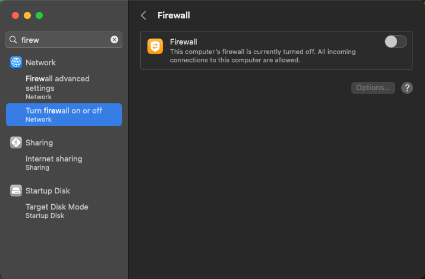

Canonical's Multipass is a wonderful tool for bootstrapping Ubuntu VMs on any platform, including macOS on Apple Silicon (M1/`arm64`). It works well, as everything, until networking breaks. The issue, debugging, and resolution story from this long afternoon reveals few tricks about both Multipass and Application Firewall on macOS, so I'll describe it in detail.

This tale is yet another confirmation of the fact that majority of macOS problems are coming from corporate security tools - I didn't have such issues even at Hackintosh era. It all started on a corporate MacBook when I had the bunch of Multipass-created VMs that suddenly stopped working - they were starting up, QEMU process was running, but Multipass couldn't check their status (it uses SSH for that). Moreover, creation of new ones was also breaking in the worst moment - QEMU process started and Multipass waited for cloud-init loaded from virtual CD-ROM to get networking and SSH. And then it just timed out.

<!--more-->

## `tl;dr` or *executive summary*

If Multipass or any other VM system ceases to provide VMs with DHCP on macOS. It can be due to Application Firewall. It may be enabled (even if shown otherwise in GUI) and blocking built-in DHCP server from receiving requests over `vmnet` (which has `192.168.64.1/24` assigned by default). To fix it, you need to whitelist `/usr/libexec/bootpd` with:

```bash
/usr/libexec/ApplicationFirewall/socketfilterfw \
  --add /usr/libexec/bootpd
/usr/libexec/ApplicationFirewall/socketfilterfw \
  --unblock /usr/libexec/bootpd
``` 

## Initial debugging

Foremost, `multipass` CLI tool supports `-vvvv` which shows some calls it is making to `multipassd` daemon. To get more details, you can check out `/Library/Logs/Multipass/multipass.log`. However, there won't be much more visible in this case - just QEMU startup and time out as everything interesting happens between the VM and host machine. That part is described in documentation under [How to access logs](https://multipass.run/docs/accessing-logs) section.

I had previous experience with how VM networking works on macOS, trying to tweak VMs in UTM. Long story short - macOS has its own virtualization framework and part of it is `vmnet` adapter, which by default has `192.168.64.1/24` address with DHCP service (it is controlled by `/Library/Preferences/SystemConfiguration/com.apple.vmnet.plist`). All the DHCP is handled by built-in system DHCP server called `bootp` that has its database in `/var/db/dhcpd_leases`.

I was following [Troubleshoot networking on macOS](https://multipass.run/docs/troubleshoot-networking#heading--troubleshoot-networking-on-macos) doc, but it didn't make any sense - I had routing set up, temporarily disabled firewall in System Settings, had VPN disabled (and no Cisco garbage that messes around with routing table), tried to grant `Developer Tools` and `Full Disk Access` pemissions to all binaries shipped with Multipass... 

However, `/var/db/dhcpd_leases` was full of entries of my Multipass-created VMs up to the point of failure - that is, no new VMs sice Multipass ceased to work were logged. 

## Chasing general network connectivity

Having VM's MAC address I tried to issue `arping`, but having limited understanding of `vmnet` and it's bridge to physical interfaces I failed (for example running `arping -i bridge100 52:54:00:01:8f:aa`) and wasn't sure if that's really due to my issue with network or not. 

### Attempts at getting into VM

From there, I made an incorrect assumption that somehow DHCP server is not getting any commands from Multipass (perhaps due to denied permissions to some system API calls). Therefore, fresh VM couldn't get IP, and as a result, it can't be controlled by Multipass. It turned out that the `bootp` just grants every machine IP as long as the pool has some free IPs for new leases. The reason why there were no new entries in DB was discovered later.

So, I tried to figure out how to get into such IP-less VM. There is no way in Multipass to attach to VM without a network. Logs available to me indicated what is the QEMU command line, so I figured out the easiest way would be to spin up such VM manually, but with serial console available to me. When I got the full command line, it looked like that:

> ```Library/Application Support/com.canonical.multipass/bin/qemu-system-aarch64 -machine virt,highmem=off -accel hvf -drive file=/Library/Application Support/com.canonical.multipass/bin/../Resources/qemu/edk2-aarch64-code.fd,if=pflash,format=raw,readonly=on -cpu cortex-a72 -nic vmnet-shared,model=virtio-net-pci,mac=52:54:00:01:8f:aa -device virtio-scsi-pci,id=scsi0 -drive file=/var/root/Library/Application Support/multipassd/qemu/vault/instances/test/ubuntu-22.04-server-cloudimg-arm64.img,if=none,format=qcow2,discard=unmap,id=hda -device scsi-hd,drive=hda,bus=scsi0.0 -smp 4 -m 4096M -qmp stdio -chardev null,id=char0 -serial chardev:char0 -nographic -cdrom /var/root/Library/Application Support/multipassd/qemu/vault/instances/test/cloud-init-config.iso```

Two things were necessary to run it with serial console. First, to replace spaces in directory names (`Application Support` with `Application\ Support`) as macOS always loved spaces in file names, while shells hate them. Second, was to repoint serial console - I chose to completely remove `-serial chardev:char0 -nographic` making it show good old QEMU window. 

It worked. But the problem is that Ubuntu Cloud images don't have any user with password, making it impossible to get access over KVM or serial console.

One important bit: you have to kill Multipass-launched QEMU to test network, as otherwise you'll end up with 2 VMs with the same MAC address (it's a part of `-nic` parameter) on one network bridge, which won't make debugging any easier!

### cloud-init with new user

The only way Ubuntu Cloud accepts any input for bootstrapping is [cloud-init](https://cloud-init.io), which is another great tool provided by Canonical that replaces ancient ways of `kickstart`. You just provide bunch of YAMLs with simple instructions (like command exec, user or file creation etc.) that are stored on some data source available to Linux processes (e.g. on a disk, virtual CD-ROM, HTTP...) and they are executed on start so the machine is ready for work. 

Multipass supports passing 'user data' part of cloud-init config to `multipass launch`, by use of flag `--cloud-init`. So, I had to craft a config file which would add a new user with password enabled authentication and `sudo` grants. It looked like that:

```yaml
users:
  - default
  - name: test
    groups: sudo
    shell: /bin/bash
    sudo: ['ALL=(ALL) NOPASSWD:ALL']
    passwd: "$6$DskYzzYIiriZpXiJ$SplVwAXCuUuahwvTUwNXkhC9501eR/ui7QnTmS8yjKl8YJDzkQzpIArosDIw.nGmrGcXhbuqJ2o6DGBnvB8uX1"
    lock-passwd: false
    ssh_pwauth: True
    chpasswd: { expire: False }
    sudo: ALL=(ALL) NOPASSWD:ALL
    groups: users, admin
```

The `default` bit made it extend the user database that was already there, and the only object injected into `users` is user with bot login and password set to `test`. The `passwd` field is SHA512 hashed password which goes directly into `/etc/shadow` and can be generated using `mkpasswd`. The rest of entries provides lazy passwordless `sudo` grant and allow the user to authenticate using password, which is non-standard.

Now it was only the matter of killing old VM (`kill -9 ${PID_OF_QEMU}`), deleting it (`multipass delete ${VM_NAME}; multipass purge`), asking Multipass to create new VM with fresh cloud-init (`multipass launch -n test --cloud-init ./users_file.yaml -vvvv`), getting new command line, adjusting it as before (spaces and `-serial chardev:char0 -nographic`), killing current instance and launching new one.

### Inside IP-less VM

Again, dead easy - *we're in*.


My experiment there involved manual assignment of IP address (`ip addr add 192.168.64.100/24 dev enp0s1`) and tests based around standard ICMP and TCP connections. And those worked. Which made run in circles wondering what's wrong. However, `nmap --script broadcast-dhcp-discover` confirmed there's nothing answering at `192.168.64.1`, which is our macOS host IP in `vmnet`. That lead me to the second part of debugging - Application Firewall on macOS.

One quick hint - QEMU on macOS uses `⌃⌥G` combination to release cursor and keyboard from inside GUI serial console window. It is mentioned in the window title, but it's easy to miss.

## Second part - Application Firewall on macOS

### *Firewall is enabled* 

As mentioned on [Troubleshoot networking on macOS](https://multipass.run/docs/troubleshoot-networking#heading--troubleshoot-networking-on-macos) I did try to disable firewall in System Settings, I tried to enable and then disable Internet Sharing without luck. During research, I found out that there's CLI tool to control firewall as well - **`/usr/libexec/ApplicationFirewall/socketfilterfw`**.

When I issued `socketfilterfw --setglobalstate off` I was quite surprised to see `Firewall is disabled. (State = 0)` instead of `Firewall already disabled`. It was especially weird when run `socketfilterfw --getglobalstate` that returned `Firewall is enabled. (State = 1)` with System Settings window open next to terminal that stated otherwise...



So, I thought it's some glitch, and I'll just restart my VM, so it can get into DHCP server and everything fixed. Well, it didn't help. Quick check of CLI tool and firewall was tuned back on.

That gave me an instant eureka moment - some corporate security package enforcing rules "manually" instead of changing OS policy to prevent user from changing that. Quickly I invented the shittiest "hotfix" I could think of - I run this lovely loop and in the other session - restarted VM. And it worked :D

```bash
while true; do 
	/usr/libexec/ApplicationFirewall/socketfilterfw \
	  --setglobalstate off
done
```

VM booted up and showed up in `multipass list`. Moreover, I could see the traffic going both ways using `tcpdump -i bridge100 port 67 or port 68 -e -n -vv`.

### Adding proper rules

As the solution was stupid and one couldn't properly implement it, I started to look around how one could whitelist DHCP traffic properly.

Firstly, Application Firewall deals with applications and not traffic. Therefore, there are rules regarding specific binaries and not TCP or UDP ports. Quick `grep` over `ps aux` pointed me to a binary called `/usr/libexec/bootpd` that is the built-in DHCP server. So, I tried to do `ocketfilterfw --unblock /usr/libexec/bootpd` or `socketfilterfw --unblockapp /usr/libexec/bootpd`, but both were failing with `The application is not part of the firewall`.

It turned out that in this system you must first add binary using `socketfilterfw --add /usr/libexec/bootpd` before explicitly blocking or unblocking it. It is still puzzling me because the default settings which I have on that machine (checked with `socketfilterfw --getallowsigned`) state that:

- *Automatically allow signed built-in software* is *ENABLED*
- *Automatically allow downloaded signed software* is *ENABLED*

and `/usr/libexec/bootpd` as expected is signed - `codesign -dvv /usr/libexec/bootpd` returns:

```
Executable=/usr/libexec/bootpd
Identifier=com.apple.bootpd
Format=Mach-O universal (x86_64 arm64e)
CodeDirectory v=20400 size=1737 flags=0x0(none) hashes=49+2 location=embedded
Platform identifier=14
Signature size=4442
Authority=Software Signing
Authority=Apple Code Signing Certification Authority
Authority=Apple Root CA
Signed Time=Dec 17, 2022 at 6:04:16 AM
Info.plist=not bound
TeamIdentifier=not set
Sealed Resources=none
Internal requirements count=1 size=64
```

So, I have no idea which logic rule made an unlisted app that matches *allow signed built-in software* rule mad something block it. Nevertheless, it was sufficient to add and then unblock `bootpd` for Multipass to start working permanently, even across reboots. Case solved and year old GitHub issue updated [https://github.com/canonical/multipass/issues/2387#issuecomment-1409321719](https://github.com/canonical/multipass/issues/2387) :)

### Confirmation in logs

As the last step, I wanted to be 100% sure it was only Application Firewall's fault. Checking logs should be easy - well, actually no.

The first step to get into firewall logs is to configure Application Firewall to log anything and do it in a detailed way. You can set it up using those 2 commands:

```bash
/usr/libexec/ApplicationFirewall/socketfilterfw --setloggingmode on
/usr/libexec/ApplicationFirewall/socketfilterfw --setloggingopt detail
```

Until some time ago, that was enough. However now, the most interesting bit is shown as `<private>` - not matter if you use `Console.app` or `log stream`. And it's impossible to change that behaviour from `socketfilterfw` CLI itself. Instead, you need to install system-wide configuration profile - the same thing normally is distributed using MDM to control system policies (on Windows it's equivalent to Group Policies).

Fortunately, you don't need to sign (using a proper certificate) such a policy for testing purposes and in most cases as long as you have local admin on macOS you should be able to install it.

The process is described in detail on [https://super-unix.com/superuser/how-to-show-private-data-in-macos-unified-log/](https://super-unix.com/superuser/how-to-show-private-data-in-macos-unified-log/). It's enough to create some `.mobileconfig` file with necessary policies, double-click it, open System Settings, go to profiles and allow installation. No reboots or anything - works immediately. 

Example `.mobileconfig` file from aforementioned post:

```xml
<?xml version="1.0" encoding="UTF-8"?>
<!DOCTYPE plist PUBLIC "-//Apple//DTD PLIST 1.0//EN" "http://www.apple.com/DTDs/PropertyList-1.0.dtd">
<plist version="1.0">
<dict>
  <key>PayloadContent</key>
  <array>
    <dict>
      <key>PayloadDisplayName</key>
      <string>ManagedClient logging</string>
      <key>PayloadEnabled</key>
      <true/>
      <key>PayloadIdentifier</key>
      <string>com.apple.logging.ManagedClient.1</string>
      <key>PayloadType</key>
      <string>com.apple.system.logging</string>
      <key>PayloadUUID</key>
      <string>ED5DE307-A5FC-434F-AD88-187677F02222</string>
      <key>PayloadVersion</key>
      <integer>1</integer>
      <key>System</key>
      <dict>
        <key>Enable-Private-Data</key>
        <true/>
      </dict>
    </dict>
  </array>
  <key>PayloadDescription</key>
  <string>Enable Unified Log Private Data logging</string>
  <key>PayloadDisplayName</key>
  <string>Enable Unified Log Private Data</string>
  <key>PayloadIdentifier</key>
  <string>C510208B-AD6E-4121-A945-E397B61CACCF</string>
  <key>PayloadRemovalDisallowed</key>
  <false/>
  <key>PayloadScope</key>
  <string>System</string>
  <key>PayloadType</key>
  <string>Configuration</string>
  <key>PayloadUUID</key>
  <string>D30C25BD-E0C1-44C8-830A-964F27DAD4BA</string>
  <key>PayloadVersion</key>
  <integer>1</integer>
</dict>
</plist>
```

Now we can go check logs. It can be done from CLI using `log stream --level info --predicate "process=='socketfilterfw'"` or from `Console.app`.

When dropped packages arrive, they appear as shown below. And correlated with surrounding entries from other subsystems and processes (easiest done using `Console.app`) they confirm it's only Application Firewall blocking the traffic and solution is accurate.

```
Info
socketfilterfw: [com.apple.alf:]
Deny bootpd data in from 0.0.0.0:68 to port 0.0.0.0:67 proto=17
```

Word of warning for inexperienced macOS hackers: **those logs are ephemeral**. That is, most of them are not stored on disk. The reason is that in debug mode they are signals from all applications that use proper macOS APIs and can contain every minor detail of operations executed, which is wonderful for debugging complex issues. For example, they contain DNS requests and answers, as well as every permission being denied for every app trying to do something in the OS. You can stream them or store to file using `log` command. But they are so huge, even `Console.app`rotates them not to eat all the RAM!

## Summary

Weird issue which seems to be plauging multiple projects like Multipass or minikube on macOS seems to be correlation of corporate tools aggresively re-enabling firewall and unexpected behaviour of Application Firewall that blocks signed system binary that should not be covered by any rule.

However, it was great learning and hacking opportunity so time not entirely wasted.
